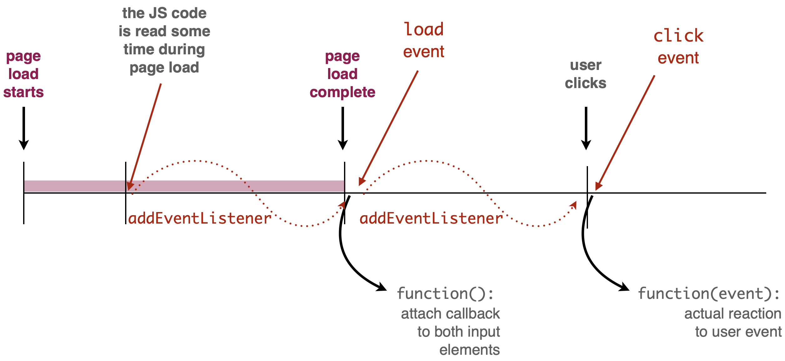

+++ {"slideshow": {"slide_type": "slide"}}

<div class="licence">
<span>Licence CC BY-NC-ND</span>
<span>Thierry Parmentelat</span>
</div>

+++ {"slideshow": {"slide_type": ""}}

# JavaScript events and callbacks

```{code-cell}
delete require.cache[require.resolve('../js/toolsv3')]
tools = require('../js/toolsv3')
tools.init()
```

+++ {"slideshow": {"slide_type": "slide"}}

## events

* due to the specificity of the browser and the network, JavaScript within the browser is not driven like other languages
  * there is no main() function that runs forever
  * it is not driven like video game with infinite loop that eats all the CPU
  * instead JavaScript is driven by **events**
* events can have different natures:
  * can come from the **user activity** such as mouse click
  * can be **time-bound**
  * can be linked to **network** activity
* mostly `load` that is rather crucial
* there are also builtin events for keyboard / mouse interaction illustrated on the next example (we use `click` and `keydown`)
* for more details, see [this section in javascript.info](https://javascript.info/event-details) on all the available events
<!-- #endregion -->

+++ {"slideshow": {"slide_type": "slide"}}

## callbacks

* events are handled using callbacks,
* callbacks are functions that are called when an event occur
* to get a function to be called on a given event, you have to use the `addEventListener`

for exemple, to have function `foo` called when the page is loaded, you can use the following code:

```js
// trigger once the document is loaded
window.addEventListener("load", foo)
```

where `load` is the name of the event  
here corresponding to the end of the page load

* many events are available ; a list of some of them is [here w3school.com](https://www.w3schools.com/jsref/dom_obj_event.asp)

+++ {"slideshow": {"slide_type": "slide"}}

### `addEventListener`

+++

* a fundamental tool to record a callback with an event
* available on most objects
* observe on the example how the callbacks **receive the event** in parameter
* and because we use `console.log(event)`  
  we have the option to inspect the event object in the console  
  and see all its attributes

+++ {"slideshow": {"slide_type": "slide"}}

### events example

```{code-cell}
:hide_input: false

tools.sample_from_stem("../samples/35-async-01-events",
                       {separate_show: true, width: '40em', start_with: 'js'})
```

+++ {"slideshow": {"slide_type": "slide"}}



+++ {"slideshow": {"slide_type": "slide"}}

### example - observations

+++

notice from the example :

* how `addEventListener()` are cascaded,
* how we display the events with `console.log()`  
  this is useful technique for debugging / inspecting data
* how we inspect the event object to display meaningful data

+++ {"slideshow": {"slide_type": "slide"}}

## other types of events

### code-generated events

you can create your own event by code, e.g. :

```javascript
const event = new Event('myevent')
// Listen for the event.
elem.addEventListener('myevent', foo, false)
// Dispatch the event.
elem.dispatchEvent(event)
```

+++ {"slideshow": {"slide_type": ""}}

### time-related events

```javascript
setTimeout(foo, 3000); // call foo in 3000 ms
setInterval(foo, 3000); // call foo every 3000 ms
```

+++ {"slideshow": {"slide_type": "slide"}}

## anonymous function (a.k.a *lambda*)

due to the extensive use of callbacks in JavaScript, having to name every function is annoying  
for this reason, JavaScript has 2 convenient ways to create anonymous functions:

* the legacy one:

```javascript
let mylambda0 = function (arg0, arg1) { /* some code here */ };
```
* the modern one:

```javascript
let mylambda0 = (arg0, arg1) => { /* some code here */ };
```
* /!\ Both variants are valid, even if the new one looks nicer
* also, there are subtle differences, not covered here

+++ {"slideshow": {"slide_type": "slide"}}

## anonymous function usage

in this context, it is common to create functions **on the fly**, e.g.
```javascript
window.addEventListener(
    "load", 
    // the expression on the following line
    // returns a function object
    () => console.log("page loaded")  
)
```

+++ {"slideshow": {"slide_type": "slide"}}

## previous example using arrow functions

```{code-cell}
:hide_input: false

tools.sample_from_stem("../samples/35-async-02-events",
                       {separate_show: true, width: '40em', start_with: 'js'})
```

+++ {"slideshow": {"slide_type": "slide"}}

## closures

+++

* it is rather frequent that a callback needs to access data that sits outside of the function context
* it is safe to use lexically-bound variables inside the callback
* see the `context` variable in the example below

```{code-cell}
// here the 'context' variable is not visible
{ 
    let context = {a:1, b:2};
    setTimeout( 
        function() {
            // Here the 'context' variable is visible and remain valid
            // even if we leave the block
            console.log("context is", context);
        },
        2000);
    console.log("NOW timeout armed");
} 
// here neither
try {
    context
} catch(err) {
    console.log(`OOPS ${err.message}`)
}

// wait for 2s to see that 
// the callback still triggers properly
```

+++ {"slideshow": {"slide_type": "slide"}}

### closures - continued

+++ {"cell_style": "split"}

```javascript
{ 
  let context = {a:1, b:2};
  setTimeout( 
    function() {
      console.log(context);
    },
    2000);
  console.log("armed");
}
```

+++ {"cell_style": "split"}

* `context` is created in a block
* that is long gone at the time the callback triggers
* but it is still reachable from the callback
* as it was *captured* in the closure

+++ {"slideshow": {"slide_type": "slide"}}

## limits of callbacks

+++

* highly recommended to study the [introduction to callbacks in javascript.info](https://javascript.info/callbacks)
* that highlights the fundamental drawback of using callbacks
* which is that you need to split your code into pieces and fit the pieces into functions
* it easily becomes hard to read and modify especially if there is logic involved

+++

so far we have seen a few types of events (e.g. `load`, `keydown`, `click`)

* for more details and a more exhaustive list of available events  
  see [this section in javascript.info](https://javascript.info/event-details)
