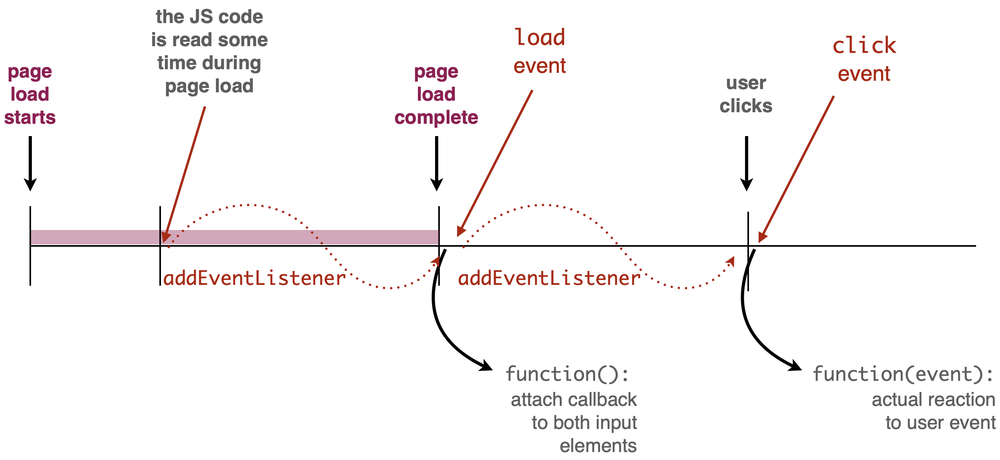

+++ {"slideshow": {"slide_type": "slide"}}

<div class="licence">
<span>Licence CC BY-NC-ND</span>
<span>Thierry Parmentelat</span>
</div>

+++ {"slideshow": {"slide_type": ""}}

# Javascript Events and Callbacks

```{code-cell}
delete require.cache[require.resolve('../js/toolsv3')]
tools = require('../js/toolsv3')
tools.init()
```

+++ {"slideshow": {"slide_type": "slide"}}

## Events

* Due to the specificity of the browser and the network, Javascript within the browser is not driven like other languages
  * there is no main() function that runs forever
  * It is not driven like video game with infinite loop that eats all the CPU
  * Instead Javascript is driven by **Events**
* Events can have different natures:
  * Events can come from the **user activity** such as mouse click
  * Events can be **time-bound**
  * Events can be linked to **network** activity
* mostly "load" that is rather crucial
* there are also builtin events for keyboard / mouse interaction illustrated on the next example (we use `click` and `keydown`)
* for more details, see [this section in javascript.info](https://javascript.info/event-details) on all the available events
<!-- #endregion -->

+++ {"slideshow": {"slide_type": "slide"}}

## Callback

* Events are handled using callbacks,
* Callback are functions that are called when an event occur
* To get a function to be called on a given event you have to use the `addEventListener`

For exemple to have the function `foo` called when the page is loaded you can use the following code:

```javascript
// trigger once the document is loaded
window.addEventListener("load", foo);
```

Where `load` is the name of the event corresponding to the end of the page load.

* Several events are available ; a list of some of them is [here w3school.com](https://www.w3schools.com/jsref/dom_obj_event.asp)

+++ {"slideshow": {"slide_type": "slide"}}

### `addEventListener`

+++

* a fundamental tool to record callback with an event
* available on most objects
* observe on the example how the callbacks receive the event in parameter
* and because we use `console.log(event)` we have the option to inspect the event object in the console, and see all its attributes

+++ {"slideshow": {"slide_type": "slide"}}

### Events example

```{code-cell}
:hide_input: false

tools.sample_from_stem("../samples/new-35-async-01-events",
                       {separate_show: true, width: '40em'})
```

+++ {"slideshow": {"slide_type": "slide"}}



+++ {"slideshow": {"slide_type": "slide"}}

### Example - observations

+++

notice from the example :

* how `addEventListener()` are cascaded,
* how we display the events with `console.log()`  
  this is useful technique for debugging / inspecting data
* how we inspect the event object to display meaningful data

+++ {"slideshow": {"slide_type": "slide"}}

## Code generated events

* Events can create your own event by code using :

```javascript
const event = new Event('myevent');
// Listen for the event.
elem.addEventListener('myevent', foo, false);
// Dispatch the event.
elem.dispatchEvent(event);
```

* You can create timed event:

```javascript
setTimeout(foo, 3000); // call foo in 3000 ms
setInterval(foo, 3000); // call foo every 3000 ms

```

+++ {"slideshow": {"slide_type": "slide"}}

## Anonymous function, i.e. lambda

Due to the extensive use of callbacks in javacript, giving a name to each function that we use once per event we setup is annoying. For this reason javascript has 2 convenient way to create anonymous functions.

* The fist one, the legacy-one:
```javascript
let mylambda0 = function (arg0, arg1) { /* some code here */ };
```
* The second one, the new fashion:
```javascript
let mylambda0 = (arg0, arg1) => { /* some code here */ };
```
* /!\ Both variant are valid, even if the new one look nicer
* Even if they look the same, they have subtile differences not covered here
* In this course you can use both.

+++ {"slideshow": {"slide_type": "slide"}}

## Anonymous function usage

in this context, it is common to create functions **on the fly** with e.g. the `function` expression

```javascript
window.addEventListener(
    "load", 
    // returns a function object
    function() { console.log("page loaded"); }  
);
```

+++ {"slideshow": {"slide_type": "slide"}}

## Previous exemple using lambda function

```{code-cell}
tools.sample_from_stem("../samples/new-35-async-02-events",
                       {separate_show: true, width: '40em'})
```

+++ {"slideshow": {"slide_type": "slide"}}

## Closures

+++

* it is rather frequent that a callback needs to access data that sit outside the function context
* it is safe to use lexically-bound variables inside the callback
* see the `context` variable in the example below

```{code-cell}
// here the 'context' variable is not visible
{ 
    let context = {a:1, b:2};
    setTimeout( 
        function() {
            // Here the 'context' variable is visible and remain valid
            // even if we leave the block
            console.log("context is", context);
        },
        2000);
    console.log("NOW timeout armed");
} 
// here neither
try {
    context
} catch(err) {
    console.log(`OOPS ${err.message}`)
}
```

+++ {"slideshow": {"slide_type": "slide"}}

### closures - continued

+++ {"cell_style": "split"}

```javascript
{ 
  let context = {a:1, b:2};
  setTimeout( 
    function() {
      console.log(context);
    },
    2000);
  console.log("armed");
}
```

+++ {"cell_style": "split"}

* `context` is created in a block
* that is long gone at the time the callback triggers
* but it is still reachable from the callback
* as it was *captured* in the closure

+++ {"slideshow": {"slide_type": "slide"}}

## Limits of callbacks

+++

* highly recommended to study the [introduction to callbacks in javascript.info](https://javascript.info/callbacks)
* that highlights the fundamental drawback of using callbacks
* which is that you need to split your code into pieces and fit the pieces into functions
* it easily becomes hard to read and modify especially if there is logic involved

+++

so far we have seen a few types of events

* mostly "load" that is rather crucial
* there are also builtin events for keyboard / mouse interaction illustrated on the next example (we use `click` and `keydown`)
* for more details, see [this section in javascript.info](https://javascript.info/event-details) on all the vailable events

+++ {"slideshow": {"slide_type": "slide"}}

## Step #3

Finish the exemple to get the following result.
_Tips:_ If changing color is difficult, you can change the dot radius.
<!-- #endregion -->

```{code-cell}
tools.sample_from_stem("../samples/spinning-wheel")
```
