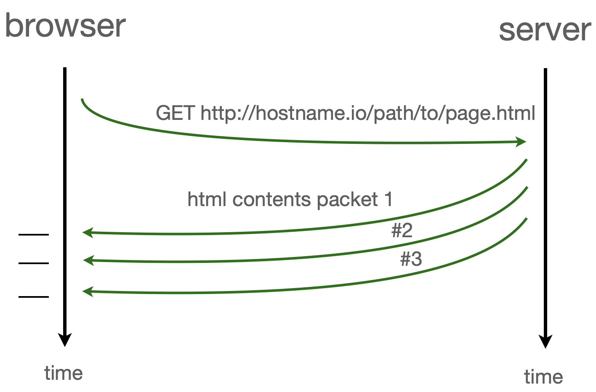

---
jupyter:
  celltoolbar: Slideshow
  jupytext:
    cell_metadata_filter: all,-hidden,-heading_collapsed,-run_control,-trusted
    formats: md
    notebook_metadata_filter: all,-language_info,-toc,-jupytext.text_representation.jupytext_version,-jupytext.text_representation.format_version
    text_representation:
      extension: .md
      format_name: markdown
  kernelspec:
    display_name: Javascript (Node.js)
    language: javascript
    name: javascript
  nbhosting:
    title: asynchronism
  rise:
    autolaunch: true
    slideNumber: c/t
    start_slideshow_at: selected
    theme: sky
    transition: cube
---

<!-- #region slideshow={"slide_type": "slide"} -->
<div class="licence">
<span>Licence CC BY-NC-ND</span>
<span>Thierry Parmentelat</span>
</div>
<!-- #endregion -->

<!-- #region slideshow={"slide_type": ""} -->
# Javascript asynchronous behaviour
<!-- #endregion -->

```javascript
tools = require('../js/toolsv2')
tools.init()
```

<!-- #region slideshow={"slide_type": "slide"} -->
## Why javascript is mostly asynchronous: page loading
<!-- #endregion -->

### reminder : a few orders of magnitude

* CPU + memory : 1 ns
* storage :
  * SDD : 100 µs
  * HDD : 1-10 ms
* networking :
  * light-speed Paris-SF : 30 ms
  * light-speed Paris-Nice : 3 ms
  * plus, software stack traversals
  * plus, protocols = several back and forths
  * bottom line: more in the **several 100s of ms**
  * frequently several seconds

<!-- #region slideshow={"slide_type": "slide"} -->
### a simple page
<!-- #endregion -->

<!-- #region cell_style="split" -->
when loading the simplest possible page, contents get scattered into packets, so it does not arrive all at once
<!-- #endregion -->

<!-- #region cell_style="split" -->

<!-- #endregion -->

<!-- #region slideshow={"slide_type": "slide"} -->
### a page and a nested page
<!-- #endregion -->

<!-- #region cell_style="split" -->
in the case of a page that has **a nested page** (e.g. a css style) there are 2 http requests at work
<!-- #endregion -->

<!-- #region cell_style="split" -->

<!-- #endregion -->

<!-- #region slideshow={"slide_type": "slide"} -->
### loading a real page
<!-- #endregion -->


<!-- #region slideshow={"slide_type": "slide"} -->
##  Summarize why

* Fetching data from internet is slow
* Not wasting time to wait for each component
* Prefer to create content as soon as possible to hide some latency
* Do not use a busy loop that waste CPU cycles
* Fetch resources concurrently when possible
* Run code concurrently when possible
<!-- #endregion -->

<!-- #region slideshow={"slide_type": "slide"} -->
## Page loading issue

* The issue is due to the fact that in most cases,  the code order matter
* For instance you cannot get an element from code that was not created
* You cannot use a given javascript library if its code is not loaded before
* Dependency may be very tricky, and can end in a loop dependency : A require B that require A.
<!-- #endregion -->

<!-- #region slideshow={"slide_type": "slide"} -->
## General issue

* The code can become the pyramid of doom by cascading callbacks
* To mitigate the issue there is 2 tools:
  * Promise
  * `async`/`await`
<!-- #endregion -->

<!-- #region slideshow={"slide_type": "slide"} -->
## Promises
<!-- #endregion -->

a relatively new alternative to callbacks that tries to address the 'pyramid of Doom' as described in the article mentioned above

the following example tries to illustrate

* that promises can deal with error conditions
* and that they allow to pass return values along the chain

as you will see however, it clearly gets some time to be able to read promises fluently :)

```javascript slideshow={"slide_type": "slide"}
// this is just an accessory cell

// we declare a variable 

// the next cell will run OK 
// for the first time
// and fail for the second time

failure_toggle = 1
```

```javascript slideshow={"slide_type": "slide"}
new Promise(
    function (resolve, reject) {

        // make it work or fail every other time
        failure_toggle = !failure_toggle;

        // a promise must use resolve or reject exactly once
        // depending on successful or not
        if (failure_toggle) {
            // in case of failure, do not wait
            reject(1);
        } else {
            // in case of success, wait for 1 s
            setTimeout(() => resolve(1), 500);
        }
    }
).then(
    // first argument to then is in case of success (resolve is used)
    (result) => {
        console.log(result);
        return result * 2;
    },
    // second is for the cases where reject is called
    (result) => console.log(`error with ${result}`)
).then(
    function (result) {
        console.log(result);
        return result * 3;
    }
);
```

<!-- #region slideshow={"slide_type": "slide"} -->
### more on promises and async

for those interested, more details on promises can be found in the rest of [this chapter on javascript.info](https://javascript.info/async) [starting here](https://javascript.info/promise-basics)
<!-- #endregion -->

## `async` keyword 


With `async` you can declare functions that are `Promise` by default

```javascript
// when called this fonction will be a promise as the previous code
async function foo() {
    // make it work or fail every other time
    failure_toggle = !failure_toggle;

    // a promise must use resolve or reject exactly once
    // depending on successful or not
    if (failure_toggle) {
        // in case of failure, do not wait
        throw 1; // Equivalent to reject(1);
    } else {
        // in case of success, wait for 1 s
        return 1; // Equivalent to resolve(1);
    }
}

// Call the function as promise
foo().then(
    // first argument to then is in case of success (resolve is used)
    (result) => {
        console.log(result);
        return result * 2;
    },
    // second is for the cases where reject is called
    (result) => console.log(`error with ${result}`)
).then(
    function (result) {
        console.log(result);
        return result * 3;
    }
);
```

## `await` keyword


* The keyword `await` allow to wait for the result of a promise
* `await` can only used in `async` function
* They cannot be used in the global scope

```javascript
async function foo() {
    // make it work or fail every other time
    failure_toggle = !failure_toggle;

    // a promise must use resolve or reject exactly once
    // depending on successful or not
    if (failure_toggle) {
        // in case of failure, do not wait
        throw 1; // Equivalent to reject(1);
    } else {
        // in case of success, wait for 1 s
        return await new Promise(
            (resolve, reject) => {
                setTimeout(() => resolve(1), 3000)
            }
        );
    }
}

// Call the function as promise
foo().then(
    // first argument to then is in case of success (resolve is used)
    (result) => {
        console.log(result);
        return result * 2;
    },
    // second is for the cases where reject is called
    (result) => console.log(`error with ${result}`)
).then(
    function (result) {
        console.log(result);
        return result * 3;
    }
);
```
